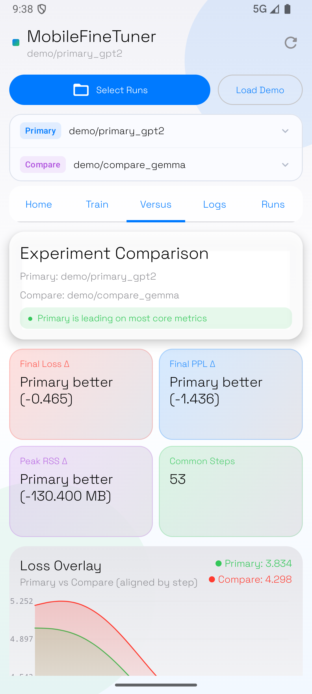
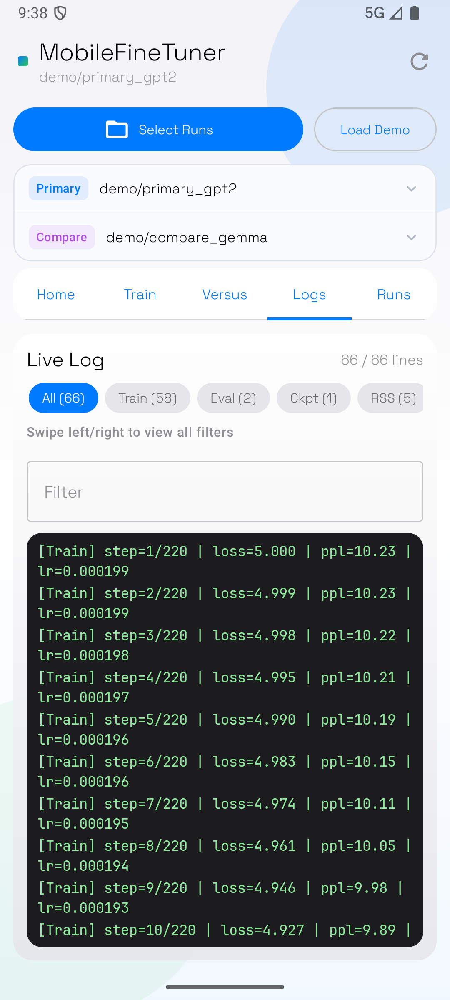

# MobileFineTuner Android Visualizer

A research-grade Android dashboard for monitoring and visualizing on-device LLM fine-tuning in real time. Designed as the companion app to the [MobileFineTuner](https://github.com/your-repo/MobileFineTuner) framework — a pure C++17 system that fine-tunes GPT-2 Gemma, and Qwen models directly on mobile hardware.

---

## Screenshots

<table>
  <tr>
    <td align="center"><br/><b>Overview</b><br/>Live progress ring, metric cards with sparklines</td>
    <td align="center"><br/><b>Memory Dynamics</b><br/>Realtime phase chart + event timeline</td>
    <td align="center"><br/><b>Training Charts</b><br/>Bezier curves with Y-axis labels, horizontal pan + double-tap zoom</td>
  </tr>
  <tr>
    <td align="center"><br/><b>Comparison</b><br/>Side-by-side runs with winner banner</td>
    <td align="center"><br/><b>Live Logs</b><br/>Terminal viewer with one-tap filter chips</td>
    <td align="center"><br/><b>Run Browser</b><br/>Model-type badges, primary/compare selection</td>
  </tr>
</table>

---

## Features

### Dashboard Tabs

| Tab | Description |
|-----|-------------|
| **Home** | Run name, status pill (Running/Completed/Failed), circular progress ring showing step %, four live metric cards (Loss, PPL, LR, Peak RSS) each with a sparkline micro-chart, a realtime memory dynamics phase chart (data-driven from current run), and a stemmed event timeline |
| **Train** | Interactive time-series charts for Loss, Perplexity, Learning Rate, and RSS Memory. Catmull-Rom bezier-smoothed curves with Y-axis value labels and X-axis step labels, horizontal drag-to-pan, double-tap zoom/reset, and tap-to-inspect individual steps |
| **Versus** | Side-by-side comparison of two runs aligned by step. Winner banner (green = primary leading, amber = compare leading), delta MetricCards, and three overlay charts (Loss, PPL, RSS) |
| **Logs** | Terminal-style log viewer with one-tap filter chips (All / Train / Eval / Ckpt / RSS / Energy / Warn / Error), real-time line counts per category, a free-text fallback filter, and syntax-colored output |
| **Runs** | Scrollable list of discovered run folders. Model-type inference badge (GPT-2, Gemma, LoRA). Set any run as Primary or Compare |

### Key Visualizations

- **Realtime Memory Dynamics** — A data-driven phase chart computed from the active run (`metrics` + `rss.csv`), with tap-to-focus details, per-phase LR/loss-variance chips, and an LR/volatility heatstrip for explainable training feedback.
- **Circular Progress Ring** — Animated sweep-gradient arc showing training completion percentage with step counter.
- **Sparkline Micro-Charts** — 30-point trend lines embedded in each MetricCard, using Catmull-Rom smoothing.
- **Stemmed Event Timeline** — Chronological event list with colored dot + vertical gradient connector lines and type badges (EVAL, CHECKPOINT, RSS, ENERGY, WARNING, ERROR, INFO).

### Data Sources

The app auto-detects runs by scanning for `train.log`. Additional files enrich the visualization:

| File | Required | Content |
|------|----------|---------|
| `train.log` | **Yes** | Raw training output (GPT-2 or Gemma format) |
| `rss.csv` | No | Resident set size samples over time |
| `metrics.ndjson` / `metrics.jsonl` | No | Structured per-step metrics (highest priority) |

Metrics from all sources are merged by step number. Structured NDJSON takes priority over log-parsed values for any given step.

---

## Log Format Compatibility

### GPT-2 Style

```
[Train] (global 100/1000) | lr 1.5e-04 | loss 3.241 | ppl 25.53 | tokens 102400
```

### Gemma Style

```
[Step 100] Loss=3.241 PPL=25.53 LR=0.000150
```

### Structured NDJSON (recommended for richest visualization)

```json
{"step":100,"total_steps":1000,"loss":3.241,"ppl":25.53,"lr":0.00015,"tokens":102400}
```

### RSS CSV

```
tick,timestamp,rss_mb
0,2025-01-01T12:00:00,1820.4
1,2025-01-01T12:00:02,1825.1
```

### Events Parsed from Logs

| Log tag | Event type |
|---------|-----------|
| `[Eval]` | EVAL |
| `[Checkpoint]` | CHECKPOINT |
| `[MemCleanup]` | CLEANUP |
| `[RSSSummary]`, `[RSSStep]` | RSS |
| `[Energy]`, `sleep_ms` | ENERGY |
| `warn`, `⚠` | WARNING |
| `error`, `failed` | ERROR |
| `[Train]`, `[Step` | INFO |

---

## Requirements

- **Build host**: macOS or Linux
- **JDK**: 17 or newer
- **Android SDK**: API 26+ (target API 36)
- **Device or emulator**: Android 8.0+ recommended; Android 10+ for full SAF permissions

---

## Build

```bash
cd android-visualizer
./gradlew assembleDebug
```

Output APK:

```
app/build/outputs/apk/debug/app-debug.apk
```

For a release-signed build, configure `keystore.properties` and run:

```bash
./gradlew assembleRelease
```

---

## Deploy to Android Device

### Via ADB (command line)

1. Enable **Developer Options** on your phone: Settings → About phone → tap "Build number" 7 times.
2. Enable **USB Debugging**: Settings → Developer options → USB debugging.
3. Connect device via USB and verify:
   ```bash
   adb devices
   # Expected: <serial>   device
   ```
4. Install the APK:
   ```bash
   adb install -r app/build/outputs/apk/debug/app-debug.apk
   ```
5. Launch the app:
   ```bash
   adb shell am start -n com.mobilefinetuner.visualizer/.MainActivity
   ```

If `adb` is not in your PATH, use the full path:

```bash
~/Library/Android/sdk/platform-tools/adb
```

### Via Android Studio

1. Open the `android-visualizer/` folder as the project root.
2. Connect your device or start an emulator (API 30+ recommended).
3. Click **Run ▶** or press `Shift+F10`.

---

## Using with Real Training Data

### Option A — Push logs to phone storage

```bash
# After a MobileFineTuner run, push the output folder to the phone
adb push /path/to/runs/my_gpt2_run /sdcard/Download/mft_runs/my_gpt2_run
```

### Option B — Access logs on the phone directly

If training runs on the phone itself, the log files are already on-device.

### In the app

1. Tap **Select Runs** and choose the parent folder containing one or more run directories.
2. The app recursively scans up to 10 levels deep for any folder containing `train.log`.
3. Select a **Primary** run from the dropdown.
4. Optionally select a **Compare** run for the Versus tab.
5. The app polls for updates every 1.5 s (RUNNING) or 3.5 s (idle/completed).

---

## Demo Mode

Tap **Load Demo** to load 220 synthetic training steps with two mock runs (GPT-2 primary vs. Gemma compare). The demo updates in real time at ~1.2 s/step, exercising all five tabs and chart interactions without needing any actual training data.

---

## Project Structure

```
android-visualizer/
├── app/
│   └── src/main/java/com/mobilefinetuner/visualizer/
│       ├── MainActivity.kt               # Entry point and app shell
│       ├── data/
│       │   └── TrainingLogParser.kt      # GPT-2 / Gemma / NDJSON / CSV parser
│       ├── model/                        # Data classes (RunSnapshot, StepMetric, …)
│       ├── ui/
│       │   ├── DashboardScreen.kt        # 5-tab scaffold + all tab composables
│       │   ├── components/
│       │   │   ├── InteractiveSeriesChart.kt   # Bezier line chart with zoom/pan
│       │   │   ├── MemoryWaterfallChart.kt     # realtime phase-based memory dynamics
│       │   │   ├── MetricCard.kt               # KPI card with sparkline
│       │   │   ├── StatusPill.kt               # Running/Completed/Failed badge
│       │   │   └── TerminalLogView.kt          # Log viewer with filter chips
│       │   └── theme/
│       │       ├── Color.kt             # Research dashboard color system
│       │       ├── Theme.kt             # MaterialTheme setup
│       │       └── Type.kt              # Typography
│       └── viewmodel/
│           └── ExperimentViewModel.kt   # MVVM state, polling, demo builder
├── docs/
│   └── screenshots/                     # UI screenshots for README
├── scripts/
│   └── qa/                              # One-click device QA script
└── verification/
    └── device_qa_release_latest/        # Reference screenshots + QA report
```

---

## Validation

Run all checks locally:

```bash
./gradlew :app:testDebugUnitTest :app:lintDebug :app:assembleDebug
```

Expected result: BUILD SUCCESSFUL, no functional lint errors.

---

## One-Click Device Acceptance Script

Run a full on-device acceptance pass (build, install, auto tab switching, video recording, and screenshot suite):

```bash
./scripts/qa/mobile_device_qa.sh \
  --out-dir verification/device_qa_release_latest \
  --video-seconds 36 \
  --shot-interval 4
```

Outputs:

- `verification/device_qa_release_latest/QA_REPORT.txt`
- Full-tab screenshots (`Home`, `Train`, `Versus`, `Logs`, `Runs`)
- Focus-state screenshots (filter input, step focus, chart interactions)
- One MP4 session recording

Use this before every release tag to keep acceptance artifacts reproducible.

---

## Explainability Notes

The Home tab memory panel is intentionally **not hardcoded**. It rebuilds phase bars from live training snapshots:

- Splits current run into adaptive windows by progress
- Computes phase-level RSS, loss, PPL, LR, and loss-delta variance
- Supports tap-to-focus for each phase and instant detail drill-down
- Updates continuously as new training steps arrive

If you want to cite paper benchmark numbers (for publication or demo narration), keep them in your paper/report text rather than fixing them inside the UI.

---

## Troubleshooting

| Symptom | Fix |
|---------|-----|
| `adb devices` shows `unauthorized` | Accept the USB debugging prompt on the phone |
| App installed but no runs appear | Confirm the selected folder contains at least one subdirectory with `train.log` |
| Charts show "No data" | Check that `train.log` matches either the GPT-2 or Gemma log format, or add a `metrics.ndjson` |
| Demo doesn't start | Tap **Load Demo** after the app has fully launched |
| Emulator won't boot | Try `emulator @<avd_name> -no-audio -no-boot-anim -gpu swiftshader_indirect` |

---

## License

See the root repository [LICENSE](../LICENSE) file.
