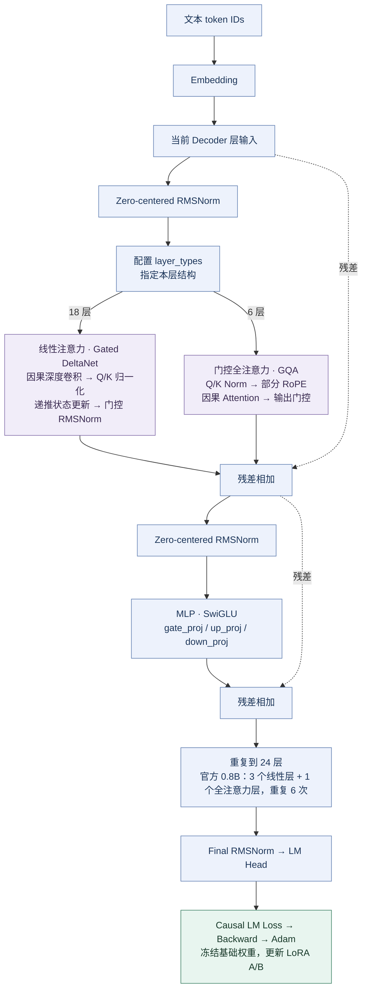

# Qwen3.5-0.8B 纯文本训练结构

本图的层数与排列对应官方 0.8B 配置。每层只执行配置选定的一个 mixer；18 个线性注意力层与 6 个全注意力层交替组成 24 层 decoder。残差分支已标出。基础权重冻结，LoRA 可注入两类 mixer 和 MLP 的线性投影。

```mermaid
flowchart TB
    tokens["文本 token IDs"] --> embed["Embedding"]
    embed --> layerin["当前 Decoder 层输入"]
    layerin --> norm1["Zero-centered RMSNorm"]
    norm1 --> kind["配置 layer_types<br/>指定本层结构"]
    kind -->|"18 层"| linear["线性注意力 · Gated DeltaNet<br/>因果深度卷积 → Q/K 归一化<br/>递推状态更新 → 门控 RMSNorm"]
    kind -->|"6 层"| full["门控全注意力 · GQA<br/>Q/K Norm → 部分 RoPE<br/>因果 Attention → 输出门控"]
    linear --> add1["残差相加"]
    full --> add1
    layerin -. "残差" .-> add1
    add1 --> norm2["Zero-centered RMSNorm"]
    norm2 --> mlp["MLP · SwiGLU<br/>gate_proj / up_proj / down_proj"]
    mlp --> add2["残差相加"]
    add1 -. "残差" .-> add2
    add2 --> repeat["重复到 24 层<br/>官方 0.8B：3 个线性层 + 1 个全注意力层，重复 6 次"]
    repeat --> finalnorm["Final RMSNorm → LM Head"]
    finalnorm --> train["Causal LM Loss → Backward → Adam<br/>冻结基础权重，更新 LoRA A/B"]
    classDef main fill:#edf2fc,stroke:#6683b4,color:#1d365b;
    classDef mixer fill:#f1edf9,stroke:#8772ac,color:#3a2b52;
    classDef train fill:#e8f5ef,stroke:#44866b,color:#183a2a;
    class tokens,embed,layerin,norm1,kind,add1,norm2,mlp,add2,repeat,finalnorm main;
    class linear,full mixer;
    class train train;
```
